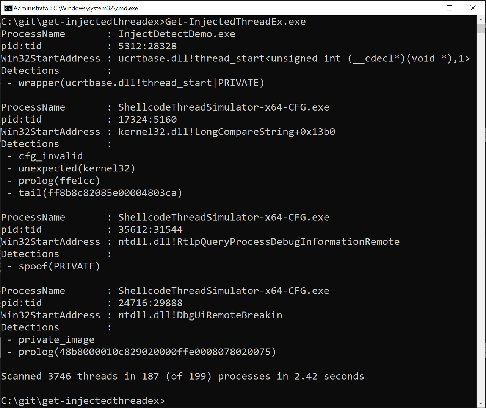



# Get-InjectedThreadEx

[Get-InjectedThreadEx.exe](https://github.com/jdu2600/Get-InjectedThreadEx/releases/latest) scans all running threads looking for suspicious Win32StartAddresses.

Win32Startaddress anomalies include -
 * not MEM_IMAGE
 * non-MEM_IMAGE return address within the first 5 stack frames
 * MEM_IMAGE and on a private (modified) page
 * MEM_IMAGE and x64 dll and not a valid indirect call target
 * MEM_IMAGE and unexpected Win32 dll
 * MEM_IMAGE and x64 and unexpected prolog
 * MEM_IMAGE and preceded by unexpected bytes
 
See my [BSides Canberra 2023 talk](https://github.com/jdu2600/conference_talks/blob/main/2023-09-bsidescbr-GetInjectedThreadEx.pdf) and [Elastic Security Labs blog](https://www.elastic.co/security-labs/get-injectedthreadex-detection-thread-creation-trampolines) for more details.

